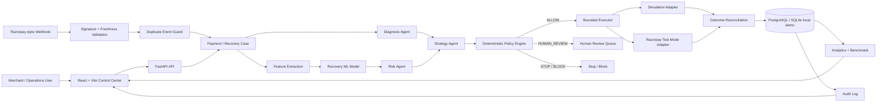
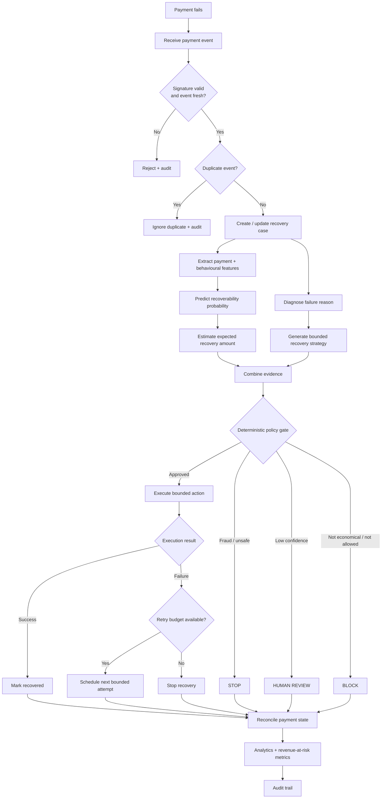

# RecoverAI — AI Revenue Recovery Control Center

**RecoverAI** is an evidence-first revenue recovery platform for payment failures. It turns a failed transaction into a bounded recovery case:

> **Detect revenue at risk → score recoverability → diagnose the failure → recommend a recovery strategy → enforce deterministic policy → execute safely → reconcile the outcome → measure recovered revenue → audit the decision.**

Built for the Razorpay AI Buildathon **Track 03 — AI Revenue Recovery**, the project focuses on the part that matters after a payment fails: recovering legitimate revenue without blindly retrying, over-contacting customers, or giving an AI model direct execution authority.

[](https://github.com/tamilarasan-1912/AI-Revenue-Recovery/actions/workflows/backend-tests.yml)
[](https://github.com/tamilarasan-1912/AI-Revenue-Recovery/actions/workflows/ci.yml)
[](LICENSE)

## Product in one sentence

RecoverAI combines **payment-event handling, behavioural ML, AI-assisted diagnosis/strategy, deterministic safety policy, bounded execution, simulation, reconciliation, analytics, and auditability** into one recovery workflow.

---

## Why payment recovery needs more than a retry button

A failed payment is not automatically a lost customer or a permanently lost transaction. The correct next action depends on **why the payment failed, the customer's payment history, retry pressure, timing, outstanding amount, fraud/risk signals, and the economics of another intervention**.

Payment platforms already use retry and recovery mechanisms because some failures are temporary while others are effectively final. Razorpay documents recurring-payment failures such as expired cards, insufficient balance and blocked cards, and exposes webhook-driven retry handling. Adyen's Auto Rescue similarly uses logic to decide which refused recurring payments should be retried later and can provide a payment-link fallback. Stripe has described ML-based Smart Retries as a way to estimate better retry timing from payment and behavioural signals.

RecoverAI takes that idea further by making the decision process **inspectable and policy-bounded**:

- AI/ML produces recommendations and probabilities, not payment authority.
- Deterministic policy rules decide whether an intervention is allowed.
- Fraud signals can force an immediate stop.
- Retry budgets are bounded.
- Low-confidence cases can be escalated to a human.
- Late successful payments reconcile and cancel stale recovery work.
- Every execution has a deterministic idempotency boundary.
- The benchmark separates model training from evaluation to avoid reporting in-sample lift as production evidence.

---

## Architecture



### Architectural principle

**The model cannot execute a payment action.** The ML/AI layer recommends; the deterministic policy layer authorizes; the executor applies the approved action with an idempotency key. This separation is deliberate because payment recovery combines optimization with financial and fraud-risk constraints.

The backend is implemented as a FastAPI application with dedicated routers for webhooks, analytics, audit, simulation, review, failure injection, system health, payments, and recovery.

---

## End-to-end recovery flow



Razorpay documents webhook-based handling for subscription-payment failures, while Adyen documents retry scheduling, retry outcomes, and fallback payment-link behaviour. These patterns support the project's event-driven, retry-bounded design.

---

## Core capabilities

### 1. Payment event ingestion

RecoverAI treats webhooks as the system-of-record trigger for recovery state changes.

Supported safety controls include:

- signature validation
- freshness-window checks
- duplicate-event protection
- late-success reconciliation
- stale recovery cancellation

This mirrors the practical requirement in payment systems to process retries and outcomes through reliable event notifications rather than assuming a synchronous payment response tells the entire story.

### 2. Behaviour-based recoverability ML

The repository implements a supervised recovery model using **scikit-learn**:

- `RandomForestClassifier` for recoverability propensity
- `RandomForestRegressor` for expected recovery amount
- `DictVectorizer` for mixed categorical/numeric features
- held-out validation for benchmark metrics
- deterministic model version and training identity

The feature layer can use payment method, decline/error context, retry count, recurrence, authentication requirements, card expiry timing, customer tenure, historical payment success, days past due, payment timing, prior failure/delay counts, outstanding balance, reminder response, and related behavioural signals.

The implementation also keeps the supervised target `is_recoverable` out of the input feature set, preventing direct target leakage.

### 3. Failure diagnosis

The diagnosis layer normalizes failures into bounded classes such as:

- `temporary_bank_degradation`
- `insufficient_funds`
- `authentication_required`
- `payment_method_invalid`
- `fraud_suspected`
- `hard_decline`
- `unknown_payment_failure`

It also produces evidence and a bounded retry-safety signal.

### 4. AI-assisted strategy generation

The architecture supports risk, diagnosis, strategy, and communication agents. An optional OpenAI-compatible provider can enrich recommendations, while deterministic behaviour keeps the prototype runnable without depending on an external LLM.

The important boundary is that generated content remains **structured evidence/recommendation**, not an executable payment instruction.

### 5. Deterministic policy engine

The policy engine is the final safety gate.

Current rules include:

- block actions outside the configured allowed-action set
- stop on fraud signals
- prevent retries when the recovery plan marks them as non-retryable
- stop when no retry window is available
- route explicit escalation to human review
- stop when maximum retries are reached
- route `WAIT` decisions to human review instead of treating them as immediate money movement
- escalate low-confidence recommendations
- stop interventions when expected recovery value is below the configured intervention cost

The model is advisory; the policy engine is the deterministic authorization boundary.

### 6. Safe execution + idempotency

Execution occurs only after policy authorization. The system uses a canonical idempotency boundary to reduce duplicate-action risk.

For payment infrastructure, idempotency is especially important when clients retry requests after timeouts or transient server errors. Razorpay's documentation likewise describes using the same idempotency key for safe retries of eligible operations.

### 7. Human-in-the-loop recovery

Not every payment failure should be auto-executed. RecoverAI can route uncertain or explicitly escalated cases for review so that an operator can inspect:

- payment evidence
- diagnosis
- model confidence
- expected recovery value
- policy rules triggered
- proposed action
- audit history

### 8. Simulation and evidence

The Simulation Lab is designed to answer the buildathon's hardest question:

> **Does the recovery strategy actually recover more money than a baseline?**

The project benchmarks a synthetic failed-payment cohort against a blind-retry baseline and keeps the training cohort separate from the evaluation cohort. The five-seed evaluation protocol uses **5 independent seeds × 10,000 evaluation events** and reports aggregate mean and population standard deviation.

Reported evidence includes:

- revenue at risk
- recoverable revenue
- baseline recovered revenue
- RecoverAI recovered revenue
- recovery rate
- incremental revenue
- improvement versus baseline
- human-review rate
- unsafe actions blocked
- policy-stop and fraud-stop rates
- action distribution
- model version
- training/evaluation sizes

These numbers are explicitly **synthetic benchmark evidence**, not claims about live Razorpay production revenue.

---

## Technology stack

| Layer | Technology | Purpose |
|---|---|---|
| Frontend | React 18 + TypeScript + Vite | Recovery control center UI |
| UI / Styling | Tailwind CSS + Lucide React | Dashboard and interaction layer |
| Charts | Recharts | Recovery analytics and benchmark visualization |
| HTTP client | Axios | Frontend-to-backend API calls |
| Backend | FastAPI + Uvicorn | REST APIs, webhooks, orchestration |
| Validation | Pydantic / pydantic-settings | Typed request/config validation |
| ML | scikit-learn | Recoverability classification + recovery estimation |
| Persistence | SQLAlchemy + PostgreSQL | Recovery state, analytics, audit history |
| Local demo DB | SQLite (opt-in) | Isolated local demonstration |
| Testing | Pytest | Backend correctness and resilience tests |
| Packaging | Docker / Docker Compose | Reproducible local environment |
| Deployment | Render Blueprint / Vercel frontend support | Cloud deployment path |

---

## Repository structure

```text
AI-Revenue-Recovery/
├── backend/
│   ├── app/
│   │   ├── agents/
│   │   │   ├── communication_agent.py
│   │   │   ├── diagnosis_agent.py
│   │   │   ├── llm_provider.py
│   │   │   ├── risk_agent.py
│   │   │   └── strategy_agent.py
│   │   ├── api/
│   │   │   ├── analytics.py
│   │   │   ├── audit.py
│   │   │   ├── failure_injection.py
│   │   │   ├── payments.py
│   │   │   ├── recovery.py
│   │   │   ├── review.py
│   │   │   ├── simulation.py
│   │   │   ├── system.py
│   │   │   └── webhooks.py
│   │   ├── engine/
│   │   │   ├── executor.py
│   │   │   ├── idempotency.py
│   │   │   └── policy_engine.py
│   │   ├── config.py
│   │   ├── database.py
│   │   ├── main.py
│   │   └── ml_model.py
│   ├── tests/
│   ├── Dockerfile
│   └── requirements.txt
├── frontend/
│   ├── src/
│   ├── package.json
│   └── ...
├── .github/
│   └── workflows/
│       ├── backend-tests.yml
│       ├── benchmark.yml
│       └── ci.yml
├── docker-compose.yml
├── render.yaml
├── .env.example
└── README.md
```

---

## Quick start

### Option A — Docker Compose

```bash
git clone https://github.com/tamilarasan-1912/AI-Revenue-Recovery.git
cd AI-Revenue-Recovery
cp .env.example .env
docker compose up --build
```

Then open:

```text
http://localhost:3000
```

### Option B — Run backend locally

```bash
cd backend
python -m venv .venv
# Windows
.venv\Scripts\activate
# macOS / Linux
source .venv/bin/activate

pip install -r requirements.txt
uvicorn app.main:app --reload --host 0.0.0.0 --port 8000
```

### Run the frontend locally

```bash
cd frontend
npm install
npm run dev
```

### Run backend tests

```bash
cd backend
pytest -q
```

### Build the frontend

```bash
cd frontend
npm run build
```

---

## Configuration

Copy the example environment file and configure the variables required for your environment:

```text
DATABASE_URL=<PostgreSQL connection string>
RAZORPAY_KEY_ID=<test-mode key>
RAZORPAY_KEY_SECRET=<test secret>
RAZORPAY_WEBHOOK_SECRET=<webhook secret>
ENABLE_RAZORPAY_TEST_ACTIONS=false
ALLOW_SQLITE_FALLBACK=false
REQUIRE_WEBHOOK_SIGNATURE=true
WEBHOOK_MAX_AGE_SECONDS=300
LLM_PROVIDER=deterministic
```

### Safety defaults

Keep the following defaults for a safe demo/development environment:

```text
ENABLE_RAZORPAY_TEST_ACTIONS=false
REQUIRE_WEBHOOK_SIGNATURE=true
ALLOW_SQLITE_FALLBACK=false
LLM_PROVIDER=deterministic
```

The application exposes an explicit execution mode: `razorpay_test_mode` when test actions are enabled, otherwise `simulation`.

**Never commit `.env`, API secrets, webhook secrets, or production credentials.**

---

## Safety model

RecoverAI is intentionally designed around **bounded autonomy**.

```text
AI / ML
  ↓
Recommendation
  ↓
Deterministic policy
  ↓
Authorization
  ↓
Idempotent executor
  ↓
Payment adapter
```

This prevents a hallucinated or over-confident model output from directly becoming a payment action.

| Risk | Control |
|---|---|
| Fraudulent transaction | Immediate policy `STOP` |
| Excessive retries | Maximum retry budget |
| Low-confidence recommendation | `HUMAN_REVIEW` |
| Unsupported action | Policy `BLOCK` |
| Uneconomic intervention | Expected-value threshold |
| Duplicate webhook | Event identity guard |
| Stale webhook | Freshness window |
| Late payment success | Reconciliation + stale-action cancellation |
| Duplicate execution | Canonical idempotency key |
| Live-money accident | Test/simulation boundary |

---

## Benchmark methodology

A strong revenue-recovery system should not evaluate itself on the same records it used for training. RecoverAI therefore separates:

1. **Training cohort** — used to fit the recoverability model.
2. **Held-out evaluation cohort** — never shown during model fitting.
3. **Baseline policy** — blind-retry comparison.
4. **Recovery policy** — ML/AI recommendation followed by deterministic authorization.
5. **Repeated seeds** — used to measure variability instead of presenting a single lucky run.

The ML module calculates held-out classification metrics including accuracy, precision, recall, F1, and ROC-AUC when there are enough examples and both classes are present.

### What the benchmark is intended to prove

- Whether the policy recovers more value than a simple baseline.
- Whether the system avoids unsafe actions.
- Whether human escalation occurs where expected.
- Whether action decisions remain bounded under adverse scenarios.
- Whether duplicate and retry failures preserve execution safety.

### What the benchmark does **not** prove

Synthetic benchmark recovery is **not** evidence of a guaranteed live-business lift. Real deployment would require production data, cohort monitoring, calibration, fraud/risk integration, payment-network constraints, and ongoing model governance.

---

## Failure injection and resilience testing

The project includes dedicated failure-injection endpoints/modules so the team can demonstrate behaviour under conditions such as:

- duplicate execution attempts
- retry exhaustion
- repeated payment failure
- delayed or late-success events
- blocked or stopped policy decisions

This matters because revenue recovery is not just a prediction problem; it is a **distributed systems + risk + optimization** problem. Payment providers also document retry outcomes, retry windows, fraud declines, and maximum retry attempts.

---

## API surface

The FastAPI application exposes dedicated API routers for:

```text
/api/webhooks
/api/analytics
/api/audit
/api/simulation
/api/review
/api/recovery
/api/failure-injection
/api/system
/api/payments
```

For interactive API exploration during local development, FastAPI's generated OpenAPI/Swagger documentation is available at the normal FastAPI docs endpoint when the server is running.

---

## Deployment

The repository includes deployment configuration for:

- **Render**: backend + managed PostgreSQL + static frontend through `render.yaml`
- **Vercel**: supported frontend deployment path
- **Docker**: local and containerized deployment

The production architecture should keep PostgreSQL as the primary database and maintain the same policy, webhook, and execution boundaries used in the local system.

---

## Buildathon positioning — Razorpay Track 03

RecoverAI is designed around the core evaluation dimensions of an AI revenue-recovery system:

**1. Recover more legitimate revenue**  
Use payment behaviour and failure context to estimate which cases are worth intervening on.

**2. Avoid harmful retries**  
Apply deterministic retry limits, fraud stops, confidence thresholds, and economic thresholds.

**3. Show evidence**  
Benchmark against a baseline using held-out evaluation cohorts and repeated seeds.

**4. Make decisions auditable**  
Record the recommendation, policy version, triggered rules, execution outcome, and resulting payment state.

**5. Demonstrate engineering maturity**  
Handle duplicate events, late payment success, idempotency, test-mode boundaries, failure injection, CI, and reproducible simulation.

This is the core distinction of RecoverAI: **the demo is not only an AI prediction; it is an evidence-backed recovery control system.**

---

## Research references

The design is informed by publicly documented payment-recovery patterns:

- Razorpay — Payment Retries: recurring-payment failures, webhook handling, retry behaviour, and payment-method changes.
- Adyen — Auto Rescue: smart retry timing, retry windows, webhook outcomes, fraud-stop behaviour, maximum retry attempts, and payment-link fallback.
- Adyen — Payment lifecycle: refusal/error handling and retry-aware payment states.
- Stripe Engineering — Smart Retries: ML-based retry-timing optimization using payment and behavioural features.

These references are used for design context; RecoverAI's benchmark values and implementation remain specific to this repository.

---

## Project status

**Buildathon prototype with production-oriented safety boundaries.**

Simulation is the default execution boundary. Razorpay Test Mode execution is opt-in. Live-money movement is not enabled by default.

---

## License

Licensed under the **Apache License 2.0**. See [LICENSE](LICENSE).

---

## Repository

**GitHub:** https://github.com/tamilarasan-1912/AI-Revenue-Recovery

**Live frontend:** https://frontend-three-dun-22.vercel.app
