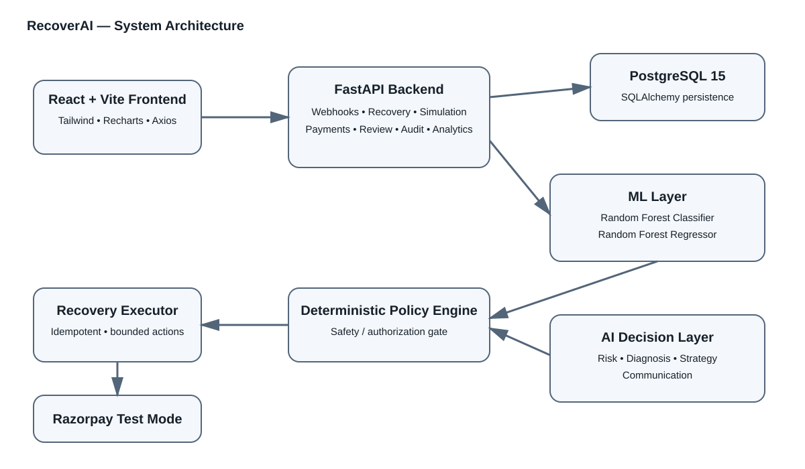
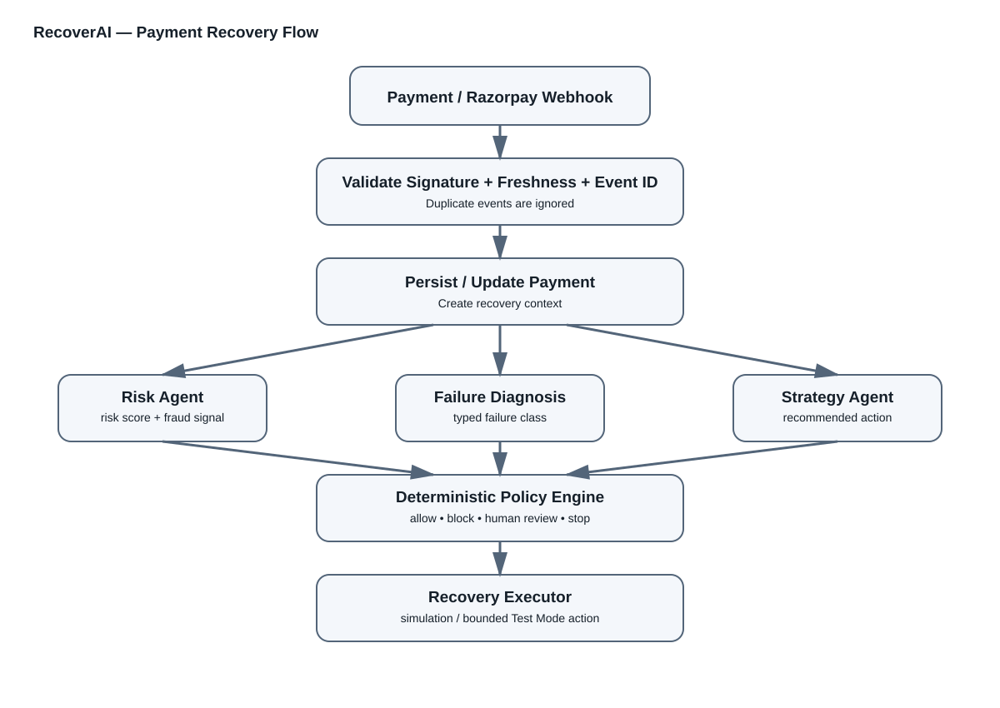
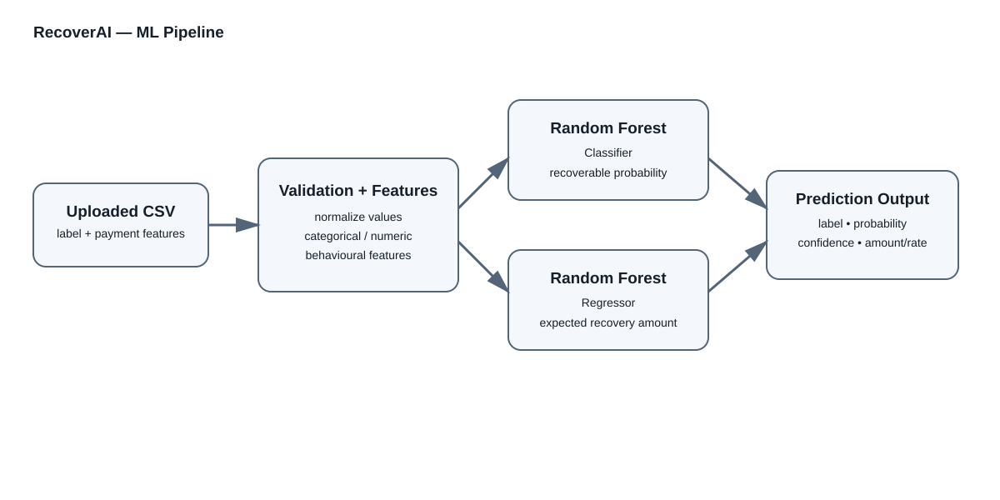

# RecoverAI — AI-Powered Revenue Recovery

RecoverAI is a payment-recovery platform that combines Machine Learning, AI decision agents, deterministic safety policies, and controlled execution to decide what should happen after a payment failure.

> **AI recommends. The deterministic Policy Engine authorizes. The Executor performs only bounded actions.**

## Architecture



## Payment Recovery Flow



## ML Pipeline



## How it works

1. A payment failure arrives through a Razorpay webhook or an uploaded CSV dataset.
2. Webhooks are checked for JSON validity, freshness, event ID duplication, and optional HMAC signature verification.
3. The failed payment is stored and a recovery context is created.
4. The Risk Agent analyses risk and fraud signals.
5. The Diagnosis layer classifies the failure.
6. The Strategy Agent recommends an action such as `RETRY`, `PAYMENT_LINK`, `HUMAN_ESCALATION`, `WAIT`, or `STOP`.
7. For dataset-based recovery, the ML model supplies recoverability probability and expected recovery value.
8. The deterministic Policy Engine checks allowed actions, fraud, confidence, retry limits, recovery-plan rules, and economic thresholds.
9. The Recovery Executor performs a controlled simulation, human-review transition, or Razorpay **Test Mode** payment-link action.
10. Execution and webhook events are recorded for audit and analytics.

## Machine Learning

The implementation in `backend/app/ml_model.py` uses two scikit-learn models:

- `RandomForestClassifier` — predicts `recoverable` vs `not_recoverable` and exposes `recoverability_probability` and confidence.
- `RandomForestRegressor` — predicts expected recovery amount and recovery rate.

The classifier uses 300 trees, max depth 14, minimum samples per leaf 2, balanced class weights, and random seed 42. If the uploaded data contains only one target class, the code safely falls back to `DummyClassifier`.

### Features

Core features include `failure_reason`, `amount`, `retry_count`, `amount_log`, and `retry_pressure`. Optional features include payment method, decline code, error source/step, currency, recurring-payment state, authentication requirement, card lifecycle, customer tenure, previous payment success rate, days past due, payment history counts, delays, outstanding amount, reminders, and reminder response rate.

The model also derives `outstanding_to_amount` and `payment_history_risk`.

## Recovery Playbook

`backend/app/recovery_playbook.py` applies deterministic failure handling.

- **Fraud/risk:** stop automatic recovery and flag for review.
- **Authentication required:** request customer authentication and use a payment-link flow.
- **Hard decline / invalid instrument:** avoid repeated retries and request a payment-method update.
- **Soft/temporary failure:** use bounded delayed retries when safe.
- **Unknown failure:** avoid blind retry and escalate for diagnosis.

Default retry delays are **24, 72 and 168 hours**, with a **30-day rescue window**.

ML guardrails include:

- probability `< 0.30` → customer-action/payment-link path
- probability `< 0.65` → human review path
- otherwise → continue through retry and policy constraints

## Safety Architecture

The Policy Engine is deliberately deterministic. It can block unsupported actions, stop fraud cases, enforce retry limits, require human review for low confidence, reject retry when the recovery plan disallows it, and stop interventions whose expected recovery value is below the configured intervention cost.

The Executor is also bounded:

- normal recovery execution is simulation-only;
- external payment-link creation is permitted only when Razorpay Test Mode is enabled;
- live Razorpay keys beginning with `rzp_live_` are rejected by the safety boundary;
- execution records use idempotency protection;
- pending recovery actions can be cancelled when a later success webhook arrives.

## Backend

The FastAPI application is defined in `backend/app/main.py` and exposes route groups for:

- `/api/webhooks`
- `/api/analytics`
- `/api/audit`
- `/api/simulation`
- `/api/review`
- `/api/recovery`
- `/api/failure-injection`
- `/api/system`
- `/api/payments`

Important simulation endpoints include:

- `POST /api/simulation/run-dataset`
- `POST /api/simulation/import-dataset`
- `POST /api/simulation/predict-recovery`
- `POST /api/simulation/predict-batch`
- `POST /api/simulation/run`
- `POST /api/simulation/run-benchmark`
- `POST /api/simulation/run-multi-seed`
- `GET /api/simulation/evaluate-database`

The uploaded dataset requires `payment_id`, `amount`, `failure_reason`, `retry_count`, and `is_recoverable`. Uploads are validated and bounded; ML training is capped at 10,000 active rows and interactive evaluation/prediction is bounded to keep requests practical.

## Database

PostgreSQL 15 is the primary database. SQLAlchemy is used for persistence. Important entities include:

- `Payment`
- `RecoveryCase`
- `PolicyDecisionRecord`
- `ExecutionRecord`
- `AuditLog`
- `SimulationRun`
- `ImportedDatasetRow`

The database layer includes controlled SQLite fallback/demo behaviour for supported degraded or dataset-demo scenarios.

## Frontend

The frontend is React 18 + TypeScript with Vite. It uses React Router, Axios, Recharts, Lucide React and Tailwind CSS. Current application components include payment, recovery and simulation interfaces plus the redesigned application UI.

## Project Structure

```text
AI-Revenue-Recovery/
├── backend/
│   ├── app/
│   │   ├── agents/          # risk, diagnosis, strategy, communication
│   │   ├── api/             # FastAPI route modules
│   │   ├── engine/          # policy, executor, idempotency
│   │   ├── simulation/      # evaluation and benchmarking
│   │   ├── database.py
│   │   ├── ml_model.py
│   │   ├── models.py
│   │   └── recovery_playbook.py
│   ├── migrations/
│   ├── scripts/
│   ├── tests/
│   ├── Dockerfile
│   └── requirements.txt
├── frontend/
│   ├── src/
│   ├── Dockerfile
│   ├── package.json
│   └── vite.config.ts
├── docs/
│   └── diagrams/
│       ├── architecture.svg
│       ├── flow.svg
│       └── ml_pipeline.svg
├── docker-compose.yml
├── render.yaml
├── .env.example
└── README.md
```

## Technology Stack

| Layer | Technology |
|---|---|
| Frontend | React 18, TypeScript, Vite |
| Styling | Tailwind CSS |
| Charts | Recharts |
| HTTP | Axios |
| Backend | FastAPI, Uvicorn |
| ORM | SQLAlchemy |
| Database | PostgreSQL 15 |
| ML | scikit-learn |
| Containerization | Docker / Docker Compose |
| Payment integration | Razorpay Test Mode |

## Run with Docker

```bash
docker compose up --build
```

Default local services:

```text
Frontend  http://localhost:3000
Backend   http://localhost:8000
Postgres  localhost:5432
```

## Run locally

### Backend

```bash
cd backend
python -m venv .venv
# activate the environment
pip install -r requirements.txt
uvicorn app.main:app --reload --port 8000
```

### Frontend

```bash
cd frontend
npm install
npm run dev
```

Use `.env.example` as the starting point for environment configuration. Never commit real credentials or webhook secrets.

## Testing

```bash
cd backend
pytest
```

## Design Principles

1. **AI is advisory:** AI components return structured recommendations rather than direct execution commands.
2. **Deterministic authorization:** the Policy Engine is the final safety gate.
3. **Bounded recovery:** retries have limits and deliberate delays.
4. **Human-in-the-loop:** uncertain cases can require reviewer approval.
5. **Idempotent execution:** duplicate recovery actions are prevented.
6. **Test-mode boundary:** external payment actions are restricted to Razorpay Test Mode.
7. **Auditability:** webhook, policy, recovery and execution records are persisted.

## Why RecoverAI

A failed payment is not automatically a payment that should be retried. RecoverAI separates two questions:

**Prediction:** *How likely is this payment to be recovered?*

**Authorization:** *Is it safe and economically reasonable to perform the proposed recovery action?*

The ML layer answers the first question. The recovery playbook and deterministic Policy Engine control the second. This separation makes the system safer, more explainable, testable and auditable.

## Future Extensions

- probability calibration and explainable AI
- richer transaction-history features
- online model monitoring
- learned recovery-action optimization
- additional payment-provider adapters
- asynchronous production job execution
- stronger secret management and webhook enforcement
- expanded offline and online evaluation

## License

See `LICENSE` for the repository license.